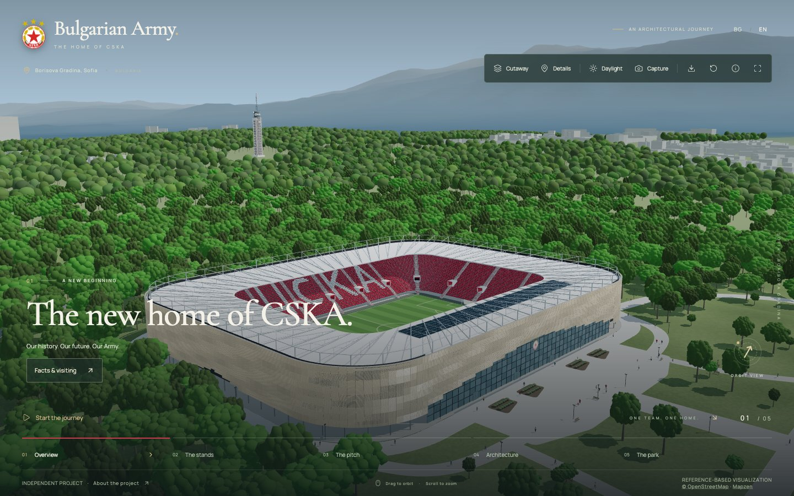

# CSKA Stadium Explorer

An interactive architectural interpretation of CSKA Sofia’s Bulgarian Army Stadium, built with **React, TypeScript, and Three.js**. Explore the stadium, move through five camera chapters, and export the procedural model straight from the browser.

**[Live demo](https://cska-stadium-explorer.vercel.app)** · **[Portfolio · Stanislav Stoynov](https://stoynov.dev)** · **[Source](https://github.com/stoynov/cska-stadium-explorer)**



## Try it

Drag to orbit and scroll or pinch to zoom. Start the guided journey, open the roof cutaway, switch between daylight and evening, or explore the stands, pitch, façade, and surrounding park. The interface is available in English and Bulgarian.

Use **Capture** to save your current view as a PNG, **Download 3D model** to export the complete stadium as GLB, and **About the project** for the development story and sources.

## Engineering highlights

- **Procedural geometry.** The stadium is constructed in TypeScript: individual façade louvers, roof trusses, seating terraces, stairways, seat lettering, pitch, and park paths. It does not load a prebuilt stadium model.
- **Rendering efficiency.** Repeated seats, trees, and visitors use instancing. Static surfaces are merged by material. Touch and narrow devices receive lower tree density, shadow resolution, and pixel-ratio limits.
- **Camera choreography.** Five aspect-aware presets share a single camera controller. User input interrupts transitions; tours stop when the tab is hidden, a dialog opens, or reduced motion is enabled.
- **Geographic context.** Vitosha uses a sampled elevation grid. Nearby building and woodland outlines come from OpenStreetMap, with an interpreted model of Sofia’s television tower.
- **Client-side exports.** PNG captures omit the interface. GLB export restores the complete roof, includes the stadium only, and validates the result through a Three.js re-import before download. Export modules load on demand.
- **Resilient interface.** Keyboard-accessible native dialogs, bilingual content, reduced-motion support, and an image fallback when WebGL is unavailable. Fonts and runtime assets are hosted locally.

## Run locally

Requires **Bun 1.3.12+** and **Node.js 22.12+**. Use a current browser with WebGL 2 support for the interactive model.

```sh
bun install --frozen-lockfile
bun run dev
```

Open the URL printed by Vite (normally `http://127.0.0.1:5173`). No environment variables, API keys, or backend services are needed.

```sh
bun run check      # Formatting, regression tests, TypeScript, production build
bun run preview    # Serve the production build locally
bun run format     # Format application code and project configuration
```

The regression suite covers viewer transitions, geometry, staircase clearance, façade layout, seat lettering, park connectivity, visitor placement, and geographic transforms. GitHub Actions runs the same checks on pushes to `main` and pull requests.

## Architecture

| Location                       | Responsibility                                                     |
| ------------------------------ | ------------------------------------------------------------------ |
| `src/App.tsx`                  | Viewer lifecycle, dialogs, language, and exports                   |
| `src/state/`                   | Pure viewer reducer and state regression tests                     |
| `src/config/`                  | Approximate dimensions, camera presets, asset and project metadata |
| `src/scene/StadiumScene.tsx`   | Renderer, scene lifecycle, lighting, and quality profile           |
| `src/scene/CameraDirector.tsx` | Camera transitions and orbit controls                              |
| `src/scene/model/`             | Procedural stadium, park, visitors, and landscape                  |
| `src/scene/data/`              | Bundled elevation and OpenStreetMap data                           |
| `src/services/export.ts`       | PNG downloads and lazy GLB export/validation                       |
| `src/ui/`                      | Toolbar, accessible dialog, and sourced stadium guide              |
| `src/content*.ts`              | English and Bulgarian copy                                         |
| `scripts/`                     | Offline geographic data preparation                                |

## Deploy to Vercel

Import this repository into Vercel. The checked-in `vercel.json` selects Vite, installs dependencies with the frozen Bun lockfile, runs `bun run build`, and serves `dist/`. No environment variables are required. Once the Git integration is connected, pushes to `main` publish production updates and pull requests receive preview deployments.

The configuration follows [Vercel’s Vite deployment documentation](https://vercel.com/docs/frameworks/frontend/vite). Research notes and source tests are excluded from CLI uploads with `.vercelignore`.

## Design process and limitations

This is an **independent portfolio project**, not an official CSKA website or surveyed architectural model. Stadium geometry, planting, and missing building heights are approximations. The procedural seat count does not establish official capacity. The visitor guide records its source-verification date and does not provide live opening, ticketing, or attendance information.

The project was developed with AI assistance. The [reference audit](docs/reference-audit.md) and [reconstruction specification](docs/reference-reconstruction-spec.md) document the process. The experience at [gpt-6-stadium.vercel.app](https://gpt-6-stadium.vercel.app/) informed interaction and composition; its downloaded model is excluded from this repository and is not used at runtime.

The 3D scene is GPU intensive, so performance varies by device. GLB consumers need support for `EXT_mesh_gpu_instancing`. There is no server rendering or offline service worker.

Further reading: [model assumptions](docs/model-assumptions.md), [façade study](docs/facade-photo-analysis.md), [staircase study](docs/staircase-photo-analysis.md), [landscape reconstruction](docs/landscape-reconstruction.md), and [stadium fact sources](docs/stadium-facts-research.md). Historical verification notes describe their respective development snapshots; model exports can be regenerated in the app.

## Credits and asset rights

Official stadium photographs, renderings, and the crest come from [stadium.cska.bg / CSKA](https://stadium.cska.bg/). Their provenance is recorded in the [asset manifest](public/assets/cska/manifest.json). Rights remain with the respective owners; this repository does not grant a reuse license for club imagery or branding.

Geographic data: © OpenStreetMap contributors (ODbL) and Mapzen Terrain Tiles. See [third-party notices](THIRD_PARTY_NOTICES.md) for source details and bundled font licenses.
