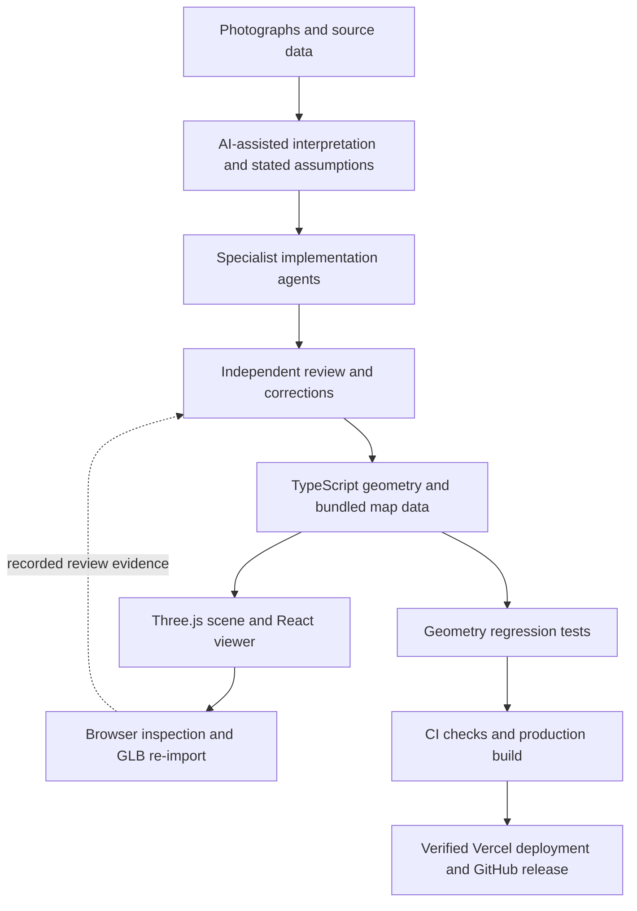

# Learning AI-assisted engineering through a procedural stadium

**Author:** Stanislav Stoynov. **Project:** [CSKA Stadium Explorer](https://cska-stadium-explorer.vercel.app).

This project began as an exercise in developing my skills with AI. The challenge was to turn photographs and an architectural experience into an inspectable, interactive model, then verify the result. The work includes directing agents, supplying better references, challenging visual mistakes, and deciding what evidence is strong enough to accept a change.

The application runs locally in the browser using TypeScript and Three.js. AI assists the development process; the deployed viewer does not call a model or require an AI API key.

## Techniques demonstrated

| Technique | How it was used | Evidence a reviewer can inspect |
| --- | --- | --- |
| Multimodal reference analysis | Compare user screenshots, official construction photographs and architectural renders; translate visible structure into explicit assumptions. | [Reference audit](reference-audit.md), [modelling assumptions](model-assumptions.md), [Sector A research](goals-sector-a-research.md). |
| Task decomposition and parallel agents | Give separate agents ownership of goals, seating/hospitality, city context and independent review; coordinate shared interfaces and file boundaries. | Separate geometry/layout modules and focused tests; recorded review findings in the research notes. |
| Independent critique | A reviewer checks generated code against reference evidence and actual geometry. The primary agent reconciles findings and validates the integrated model. | Goal ground support, terrace stair exits and corner junctions became regression checks. |
| Deterministic procedural generation | Describe geometry as dimensions, transforms, polygons and fixed-seed placement so results can be reproduced and inspected. | `src/scene/model/`, including goal panels, hospitality layout and geographic transforms. |
| Geometry-based evaluation | Test physical properties rather than accepting a plausible screenshot: connected nets, open mouths, clear passages, supported chairs and roof clearance. | `goals.test.ts`, `hospitality.test.ts`, `seating-layout.test.ts` and the city/entrance regression suites. |
| Tool-assisted verification | Run the real application, compare close-ups, exercise controls, export GLB and render the re-imported result. | [Geometry validation](goals-sector-a-research.md) and subsequent revision notes. Browser inspection is a recorded review step, not an automated CI gate. |
| Deployment provenance | Run frozen-dependency checks, verify the exact commit deployed successfully, then publish an immutable build tag and release archive. | [Workflows](../.github/workflows/), [Actions](https://github.com/stoynov/cska-stadium-explorer/actions), [Releases](https://github.com/stoynov/cska-stadium-explorer/releases). |

## What the correction loop looks like

The goal nets are a useful example. The original model looked plausible from a distance but consisted of a disconnected rear lattice. Two strand directions did not even lie on the same surface. A regression test exposed the disconnected graph. The replacement uses shared panel boundaries for the back, sides and top, with the front left open. Independent review then found a ground-height mismatch; a new test raycasts the actual surface under the net instead of checking a height constant alone.

Sector A exposed a different failure: the model repeated a generic seating profile where the reference showed lower seating and stacked hospitality spaces. The correction first removes incompatible rows and stairs, then builds the lounges and terraces. A later, clearer photograph revealed large corner passages that the earlier reconstruction still lacked. That feedback became a separate geometry task; a previous green test suite was evidence only for the properties it actually checked.

A further comparison caught a more specific error: those passages were clear but faced through the straight wall instead of the curved corners. The [diagonal correction](angled-corner-research.md) added placement checks as well as clearance checks. A reusable local research skill now archives primary-source pages and images with provenance and records which evidence has actually been inspected.

The city review caught a less visible problem: bilinear elevation sampling disagreed with the rendered terrain triangles, burying parts of the roads. The fix uses the mesh's actual triangle interpolation. The [corner and city validation record](corner-city-validation.md) documents this finding, the bounded map dataset, and the subsequent geometry and browser checks.

This is the main learning outcome: useful AI assistance needs explicit constraints, independent review and tests that can reject an attractive but incorrect result. More agents or a longer prompt do not establish correctness by themselves.

## Development and runtime boundaries



The map data provides geographic grounding; it is not retrieval-augmented generation. The procedural renderer is not a trained model. This project does not claim fine-tuning, model benchmark results, measured productivity gains, or an autonomous agent operating in production.

## Reproduce the checks

```sh
bun install --frozen-lockfile
bun run check
python3 -m unittest discover -s scripts
bun run dev
```

The Bun suite validates deterministic state and geometry; the Python 3 standard-library suite checks offline map extraction and height interpretation. Both run in GitHub CI. Browser review then checks appearance and interaction: both goal ends, the two main-stand passages from inside and outside, the city skyline from several directions, roof cutaway, evening mode, mobile layout, and the exported stadium. Report the commit, environment and failures when repeating a visual review; a historical screenshot or test count is not a current benchmark.

The [model assumptions](model-assumptions.md) and data-source notices distinguish observed facts from approximated dimensions and inferred building heights. Prompts and temporary agent instructions stay excluded from Git; the public record contains implementation decisions, sources, tests and outcomes.
